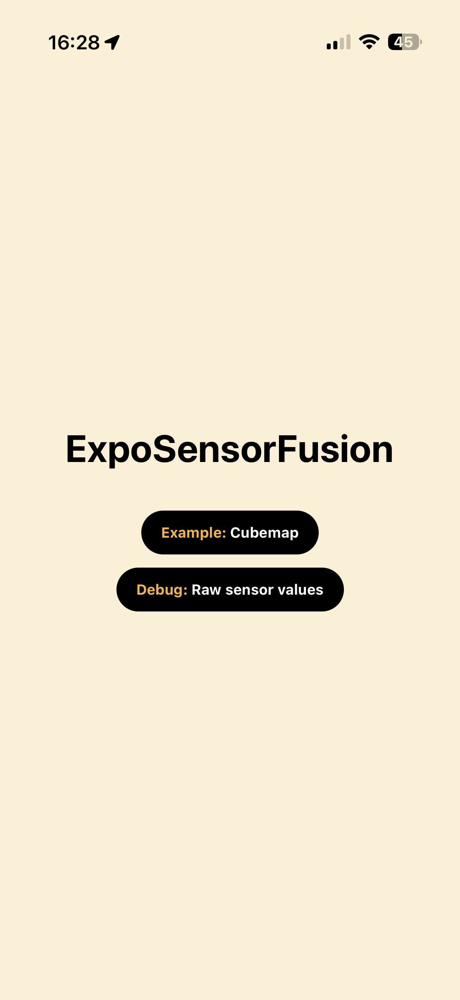
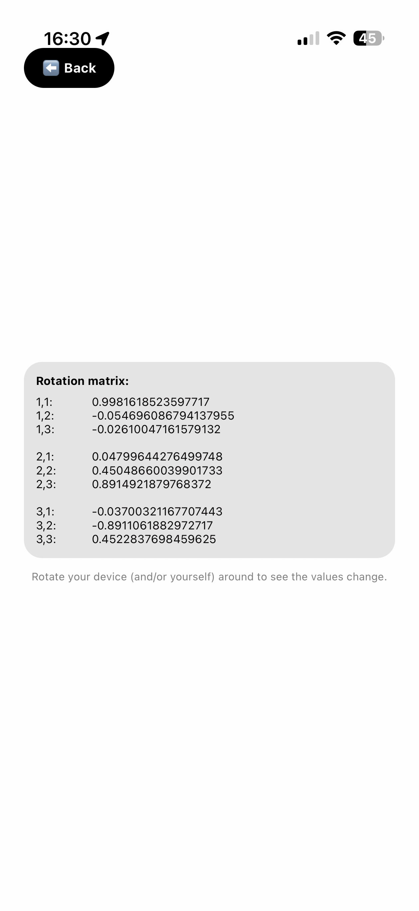

# @the-curve-consulting/expo-sensor-fusion

A react native library for reading native device rotation sensor data.

[Watch a demo video](./docs/videos/demo.mp4)

| Home                                               | Cubemap                                               | Sensor values debug                                             |
| -------------------------------------------------- | ----------------------------------------------------- | --------------------------------------------------------------- |
|  |  |  |

## Installation

This package works with both Expo and framework-less React Native projects but Expo provides a more streamlined experience.

```bash
npm install @the-curve-consulting/expo-sensor-fusion

# bun add @the-curve-consulting/expo-sensor-fusion
# pnpm add @the-curve-consulting/expo-sensor-fusion
```

### Usage

See `/example/src/` for detailed example of how to use this package.

#### Check sensor availability

```tsx
import { ExpoSensorFusion } from '@the-curve-consulting/expo-sensor-fusion';

export const App = () => {
  const [available, setAvailable] = useState(false)

  useEffect(() => {
    // Check if Sensor Fusion is available on this device
    setAvailable(ExpoSensorFusion.isSensorAvailable())
  }, [])

  return (
    <View style={{ flex: 1, justifyContent: 'center', alignItems: 'center' }}>
      <Text>
        {available ? (
          'Rotation sensors are available in this device'
        ) : (
          'Rotation sensors are not available in this device'
        )}
      </Text>
    </View>
  )
}
```

#### Subscribe to rotation matrix change events to use it with [`@react-three/fiber` + `threejs`](https://r3f.docs.pmnd.rs/)

```tsx
import { ExpoSensorFusion } from '@the-curve-consulting/expo-sensor-fusion';
import { useThree } from '@react-three/fiber';
import { Matrix4 } from 'three';

export const CameraController = () => {
  const { camera } = useThree();

  const matrixRef = useRef(new Matrix4());

  useEffect(() => {
    const rotationUpdateSubscription =
      ExpoSensorFusion.addRotationUpdateListener((event) => {
        const matrix = event.rotationMatrix;
        matrixRef.current.set(
          matrix.m11, matrix.m21, matrix.m31, 0, // eslint-disable-line prettier/prettier
          matrix.m12, matrix.m22, matrix.m32, 0, // eslint-disable-line prettier/prettier
          matrix.m13, matrix.m23, matrix.m33, 0, // eslint-disable-line prettier/prettier
          0, 0, 0, 0                             // eslint-disable-line prettier/prettier
        );
        camera.rotation.setFromRotationMatrix(matrixRef.current);
      });

    return () => {
      rotationUpdateSubscription.remove();
    };
  }, []);

  return null;
};
```

## Contributing

- Ensure you're running the correct Node version in your current terminal session: `nvm install && nvm use`
- Install all node dependencies: `npm install`
- Native source to edit using your favorite IDE: `<root>/android` or `<root>/ios`
  - Open Xcode to edit the iOS native code by running the following from the root of this repo: `npm run open:xcode`
  - Open Android Studio to edit the Android native code by running from the root of this repo: `npm run open:androistudio`
- Run the example app
  - iOS: `cd example; npm run ios`
  - Android: `cd example; npm run android`

> [!IMPORTANT]
>
> You must never have to manually edit files within `./example/android` nor `./example/ios`. These are updated / generated automatically
> everytime you run `npm run ios|android`.

- You can preview the package changes during development by running the sample expo app that is embedded into this project within `/example`:

```bash
cd example

# Start an iOS simulator with an example app (expo development client) where this package is installed (requires macOS)
npm run ios

# Start an Android emulator and installs the example app (expo development client) where this package is installed.
npm run android
```

### Publish a new version to the registry

> [!NOTE]
>
> This package follows semantic versioning with the format: `major.minor.patch`.
> - Major version: Increment when making incompatible API changes.
> - Minor version: Increment when adding new functionality in a backward-compatible way.
> - Patch version: Increment when fixing bugs in a backward-compatible manner.
****
1. Bump `package.json` version using one of: `npm version patch|minor|major`, commit and push the change to `main`.
2. Navigate to [Create a New Release](https://github.com/the-curve-consulting/expo-sensor-fusion/releases/new)
3. Create a new tag using the semantic versioning format following the bumped package version, prefixed with `v` (e.g., `E.g.: v2.3.0`).
4. Use the same name as the tag for the release title.
5. Click <kbd>Generate release notes</kbd>, and/or edit the description to detail the changes.
6. Click the green <kbd>Publish release</kbd> button.
7. A GitHub action will automatically run to publish the new version of the package to the registry.
   - Monitor the status at [the-curve-consulting/expo-sensor-fusion/actions](https://github.com/the-curve-consulting/expo-sensor-fusion/actions)
